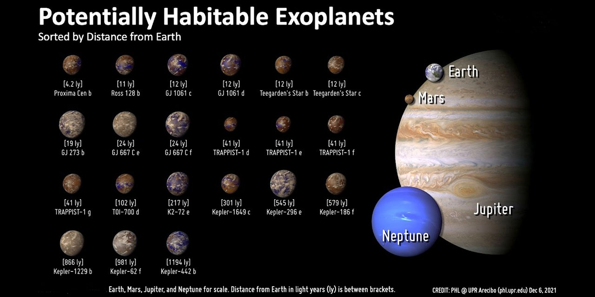

# nasa-kepler-data

The project is a Node.js terminal application that streams formatted data provided by the NASA Exoplanet Archive (astronomical exoplanet and stellar catalog) to do further analysis on the data set. The aim of the project is to identify planets that are similar to earth (exoplanets), based on thresholds out of recent researches by various institutes.

